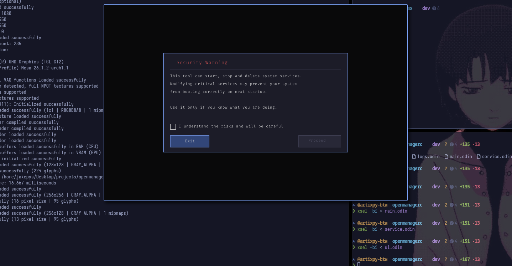
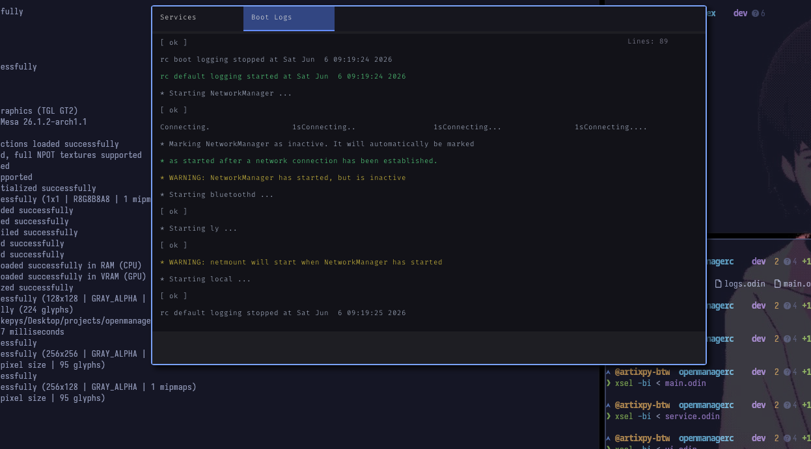

# OpenManagerRC

A simple OpenRC service manager GUI built with Odin and Raylib.

This project was born from this C++/Qt implementation I found online.
I wanted to learn Odin and Raylib, so I rewrote it from scratch as a learning exercise.
The original idea and concept belong to its author — I just used it as a target to aim at.

## Screenshots

### Disclaimer


### services


### Logs



## Dependencies

- [Odin](https://odin-lang.org) (dev-2026-05)
- [Raylib](https://www.raylib.com) 5.x
- OpenRC (XD)

```bash
# Arch
sudo pacman -S raylib
```

## Build

```bash
git clone https://github.com/jakepys/openmanagerc
cd openmanagerc

make build
```

> Must be run as root since it calls rc-service and rc-update.

```bash
odin run . -extra-linker-flags:"-lraylib -lm"
```

## Features

- List all OpenRC services with runlevel and status
- Start / Stop / Delete services
- Real-time boot logs from `/var/log/rc.log`
- Keyboard-friendly, scroll support

## License

GPLv3